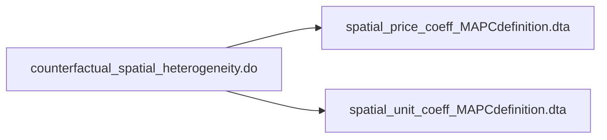
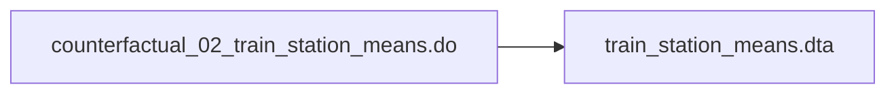
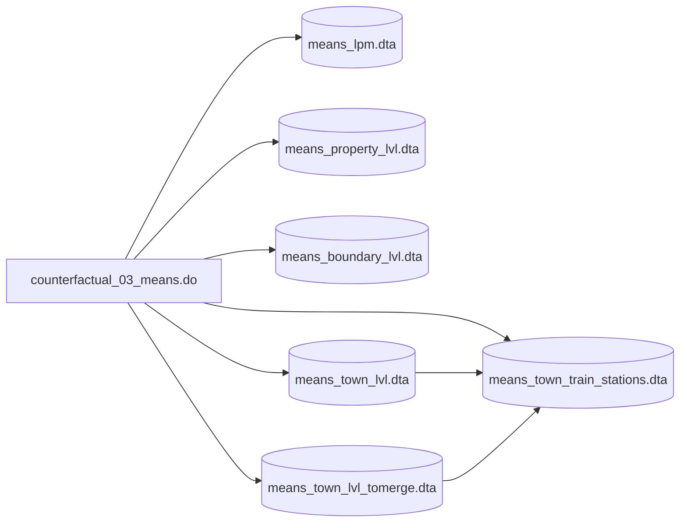

## Table of Contents
[Replication File Status](#replication-file-status)

### Replication File Status
#### Analysis Files
| File name| File cleaned | File run by Mike |
|----------|:------------:|:----------------:|
| analysis_master_file.do (ongoing) | ⚠️ | ✅ |
| analysis_within_town_setup.do | ✅ | ✅ |
| bindingness.do | ✅ | ❌ |
| counterfactual_01_spatial_heterogeneity.do | ✅ | ✅ |
| counterfactual_02_train_station_means.do | ✅ | ✅ |
| counterfactual_03_means.do (formerly means.do) | ✅ | ✅ |
| external_effects.do | ✅ | ❌ |
| predicted_prices_mtlines.do | ✅ | ❌ |
| amentities_mtlines.do | ✅ | ❌ |
| amenities_muni_boundary.do | ❌ | ❌ |
| chars_mtlines.do | ✅ | ❌ |
| main_mtlines.do | ✅ | ❌ |
| main_no_roads.do | ❌ | ❌ |
| residuals.do | ✅ | ❌ |
| robustness_mtlines.do | ✅ | ❌ |
| within_town_mtlines.do | ✅ | ❌ |
| within_town_mtlines_robustse.do | ✅ | ❌ |
| straight_line_v_walking.do | ❌ | ❌ |

#### Data Setup Files
| File name| File cleaned | File run by Mike |
|----------|:------------:|:----------------:|
| data_setup | ❌ | ❌ |
| 10_warren_data_compile.do | ❌ | ❌ |
| 11_geocoding.do | ❌ | ❌ |
| 12_res_types.do | ❌ | ❌ |
| 13_condo_collapse.do | ❌ | ❌ |
| 20_boundary_matches.do | ❌ | ❌ |
| 30_density_measures.do | ❌ | ❌ |
| 40_costar.do | ❌ | ❌ |
| 41_costar_warren_xwalk.do | ❌ | ❌ |
| 42_costar_rent_history.do | ❌ | ❌ |
| 50_nhpd.do | ❌ | ❌ |
| 51_nhpd_boundary_matches.do | ❌ | ❌ |
| 52_nhpd_warren_xwalk.do | ❌ | ❌ |
| 60_ch40b.do | ❌ | ❌ |
| 61_ch40b_boundary_matches.do | ❌ | ❌ |
| 62_ch40b_warren_xwalk.do | ❌ | ❌ |
| 70_final_dataset.do | ❌ | ❌ |
|  80_amenity_datasets.do | ❌ | ❌ |
| town_lists_export.do | ❌ | ❌ |
| warren_geocode_fixes.do | ❌ | ❌ |


### Reviewed and cleaned analysis files checklist
- [ ] analysis_master_file.do (ongoing)
- [x] analysis_within_town_setup.do
- [x] bindingness.do
- [x] counterfactual_01_spatial_heterogeneity.do
- [x] counterfactual_02_train_station_means.do
- [x] counterfactual_03_means.do (formerly means.do
- [x] external_effects.do
- [x] predicted_prices_mtlines.do
- [x] amentities_mtlines.do
- [ ] amenities_muni_boundary.do
- [x] chars_mtlines.do
- [x] main_mtlines.do
- [ ] main_no_roads.do
- {x] residuals.do
- [x] robustness_mtlines.do
- [x] within_town_mtlines.do
- [x] within_town_mtlines_robustse.do
- [ ] straight_line_v_walking.do


# <p align="center"> Analysis files flow chart </p>
The purpose of this is to document the final replication package

[GitHub readme markdown syntax](https://github.com/darsaveli/Readme-Markdown-Syntax)

[Mermaid diagram syntax documentation](https://mermaid.js.org/syntax/flowchart.html)

### counterfactual_01_spatial_hetergeneity.do


### counterfactual_02_train_station_means.do


### counterfactual_03_means.do


```
├───code
│   └───analysis_files
└───programs
    ├───analysis_files
    │   ├───counterfactual
    │   ├───Figure A5
    │   │   └───Figure A5 replication
    │   ├───postrestat_bindingness
    │   ├───postrestat_external_effects
    │   ├───postrestat_histogram
    │   ├───postrestat_means
    │   ├───postrestat_predicted_prices_mtlines
    │   ├───postrestat_rd_amenities_mtlines
    │   ├───postREstat_rd_amenities_muni_boundary
    │   ├───postrestat_rd_chars_mtlines
    │   ├───postrestat_rd_main_mtlines
    │   ├───postrestat_rd_main_no_roads
    │   ├───postrestat_rd_residuals
    │   ├───postrestat_rd_robustness_mtlines
    │   ├───postrestat_within_town_mtlines
    │   └───straight line vs walking
    └───data_setup
        └───python_programs
            ├───census_geocoder_api
            ├───closest_boundary_matches
            ├───soil_quality_data
            ├───transit_distances
            ├───walking_distances
            └───zone_assignments
```
