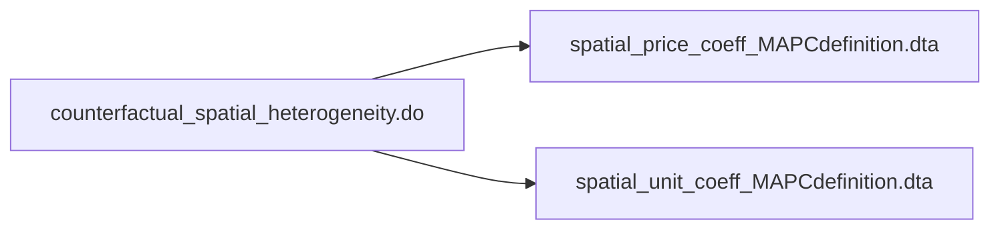

# 
 Analysis files flow chart 

The purpose of this is to document the final replication package

[GitHub readme markdown syntax](https://github.com/darsaveli/Readme-Markdown-Syntax)

[Mermaid diagram syntax documentation](https://mermaid.js.org/syntax/flowchart.html)

