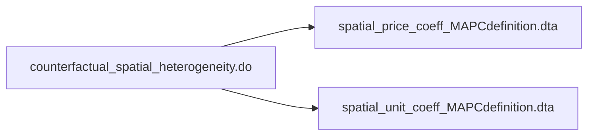

# 
 Analysis files flow chart 

The purpose of this is to document the final replication package

[GitHub readme markdown syntax](https://github.com/darsaveli/Readme-Markdown-Syntax)

[Mermaid diagram syntax documentation](https://mermaid.js.org/syntax/flowchart.html)

├───code
│   └───analysis_files
└───programs
    ├───analysis_files
    │   ├───counterfactual
    │   ├───Figure A5
    │   │   └───Figure A5 replication
    │   ├───postrestat_bindingness
    │   ├───postrestat_external_effects
    │   ├───postrestat_histogram
    │   ├───postrestat_means
    │   ├───postrestat_predicted_prices_mtlines
    │   ├───postrestat_rd_amenities_mtlines
    │   ├───postREstat_rd_amenities_muni_boundary
    │   ├───postrestat_rd_chars_mtlines
    │   ├───postrestat_rd_main_mtlines
    │   ├───postrestat_rd_main_no_roads
    │   ├───postrestat_rd_residuals
    │   ├───postrestat_rd_robustness_mtlines
    │   ├───postrestat_within_town_mtlines
    │   └───straight line vs walking
    └───data_setup
        └───python_programs
            ├───census_geocoder_api
            ├───closest_boundary_matches
            ├───soil_quality_data
            ├───transit_distances
            ├───walking_distances
            └───zone_assignments
