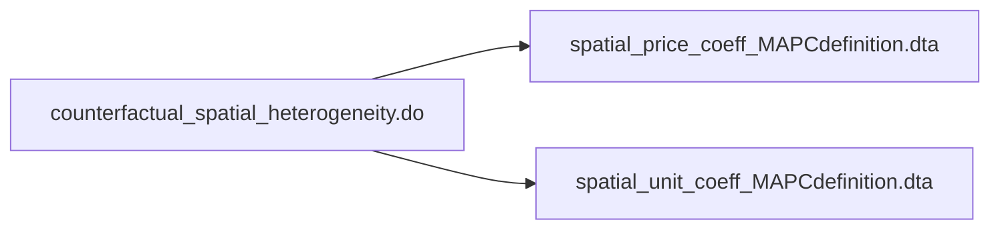

# <p align="center"> Analysis files flow chart </p>
The purpose of this is to document the final replication package

[GitHub readme markdown syntax](https://github.com/darsaveli/Readme-Markdown-Syntax)

[Mermaid diagram syntax documentation](https://mermaid.js.org/syntax/flowchart.html)

### counterfactual_01_spatial_hetergeneity.do


### counterfactual_02_train_station_means.do


### counterfactual_03_means.do
```mermaid
flowchart LR
  A[counterfactual_03_means.do] --> B[(means_lpm.dta)];
  A --> C[(means_property_lvl.dta)];
  A --> D[(means_boundary_lvl.dta)];
  A --> E[(means_town_lvl.dta)];
  A --> F[(means_town_lvl_tomerge.dta])];
  A --> G[(means_town_train_stations.dta)];
  E --> G;
  F --> G;
```

```
├───code
│   └───analysis_files
└───programs
    ├───analysis_files
    │   ├───counterfactual
    │   ├───Figure A5
    │   │   └───Figure A5 replication
    │   ├───postrestat_bindingness
    │   ├───postrestat_external_effects
    │   ├───postrestat_histogram
    │   ├───postrestat_means
    │   ├───postrestat_predicted_prices_mtlines
    │   ├───postrestat_rd_amenities_mtlines
    │   ├───postREstat_rd_amenities_muni_boundary
    │   ├───postrestat_rd_chars_mtlines
    │   ├───postrestat_rd_main_mtlines
    │   ├───postrestat_rd_main_no_roads
    │   ├───postrestat_rd_residuals
    │   ├───postrestat_rd_robustness_mtlines
    │   ├───postrestat_within_town_mtlines
    │   └───straight line vs walking
    └───data_setup
        └───python_programs
            ├───census_geocoder_api
            ├───closest_boundary_matches
            ├───soil_quality_data
            ├───transit_distances
            ├───walking_distances
            └───zone_assignments
```
