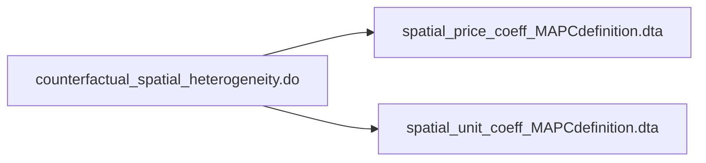
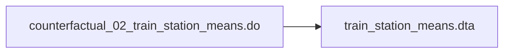
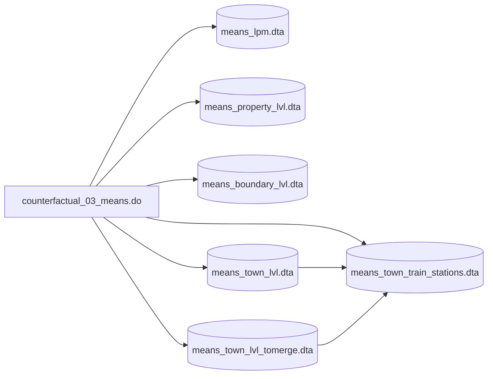

# Data Setup Files Guide

## Introduction

## Order of Files

## Files in this Directory

## Replication File Status
| File Name| Checked/Cleaned | Run Successfully by Mike | Replicates Results|
|----------|:------------:|:----------------:|:----------------:|
| 00_data_setup_master_file.do |  |  |  | 
| 10_warren_data_compile.do | ❌ | ❌ |  | 
| 11_geocoding.do | ❌ | ❌ |  | 
| 12_res_types.do | ❌ | ❌ |  | 
| 13_condo_collapse.do | ❌ | ❌ |  | 
| 20_boundary_matches.do | ❌ | ❌ |  | 
| 30_density_measures.do | ❌ | ❌ |  | 
| 40_costar.do | ❌ | ❌ |  | 
| 41_costar_warren_xwalk.do | ❌ | ❌ |  | 
| 42_costar_rent_history.do | ❌ | ❌ |  | 
| 50_nhpd.do | ❌ | ❌ |  | 
| 51_nhpd_boundary_matches.do | ❌ | ❌ |  | 
| 52_nhpd_warren_xwalk.do | ❌ | ❌ |  | 
| 60_ch40b.do | ❌ | ❌ |  | 
| 61_ch40b_boundary_matches.do | ❌ | ❌ |  | 
| 62_ch40b_warren_xwalk.do | ❌ | ❌ |  | 
| 70_final_dataset.do | ❌ | ❌ |  | 
|  80_amenity_datasets.do | ❌ | ❌ |  | 
| town_lists_export.do | ❌ | ❌ |  | 
| warren_geocode_fixes.do | ❌ | ❌ |  | 

## File descriptions

### 00_data_setup_master_file.do
This file sets all of the global paths used throughout the setup. Right now it is specific to file paths found on
the Boston Fed servers.

### 10_warren_data_compile_.do
Takes the raw downloaded warren data calls a number of sub-scripts to clean the data:
- calls 11_geocoding.do to fix lat/lon geocoding issues
- calls 12_res_types.do to condense property type classification variables and trim dataset
- called 13_condo_collapse.do to collapse condo buildiings so the number of units is summed to the address (note in the end condos were excluded because they are not captured uniformally across municipalities.

After cleaning several distinct .dta datasets are saved:
- warren_MA_all_annual.dta --> all residential properties in MA, unique by year and prop_id
- warren_MAPC_all_annual.dta --> all residential properties in the MAPC region (used as Greater Boston definition), unique by year and prop_id
- warren_MAPC_all_unique.dta --> unique list of properties in the MAPC region

**10_warren_data_compile_.do:**
```mermaid
flowchart TD
  f0[10_warren_data_compile_.do];
  d0(MA_assessor_annual_expanded.dta);

  f1@{ shape: subproc, label: "`11_geocoding.do
                              "12_res_types.do"
                                13_condo_collapse.do`" };
  f2@{ shape: subproc, label: "12_res_types.do" };
  f3@{ shape: subproc, label: "13_condo_collapse.do" };

  d2(warren_MA_all_annual.dta);
  d3(warren_MAPC_all_annual.dta);
  d4(warren_MAPC_all_unique.dta);
  
  d0 --> f0;
  f0 --> f1 --> f2 --> f3;
  f3 --> d2;
  f3 --> d3;
  f3 --> d4;
```


### counterfactual_01_spatial_hetergeneity.do


### counterfactual_02_train_station_means.do


### counterfactual_03_means.do

