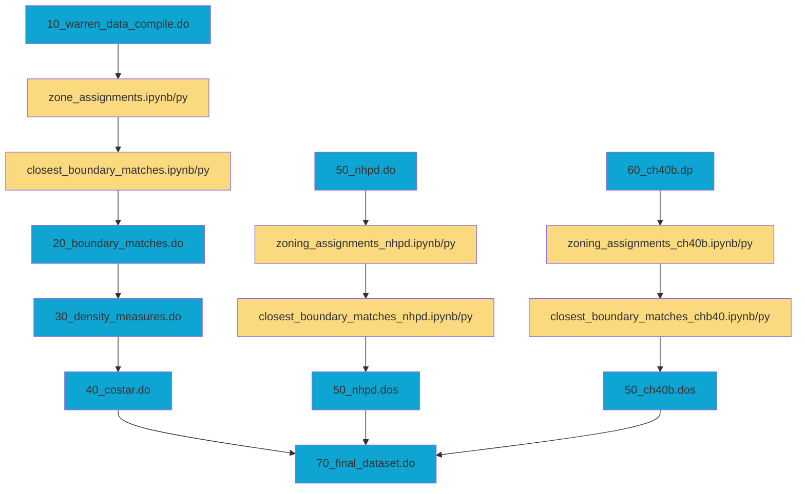
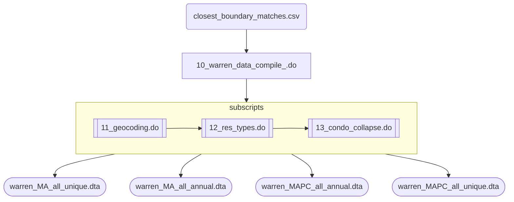
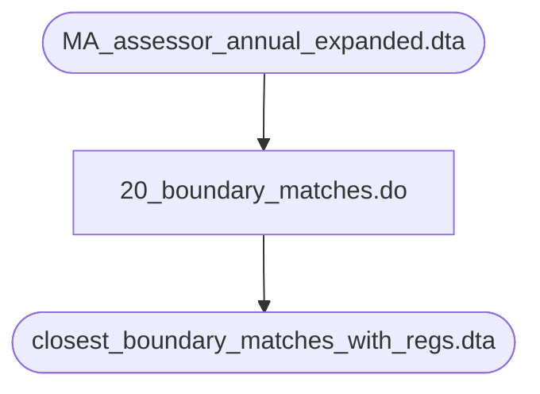
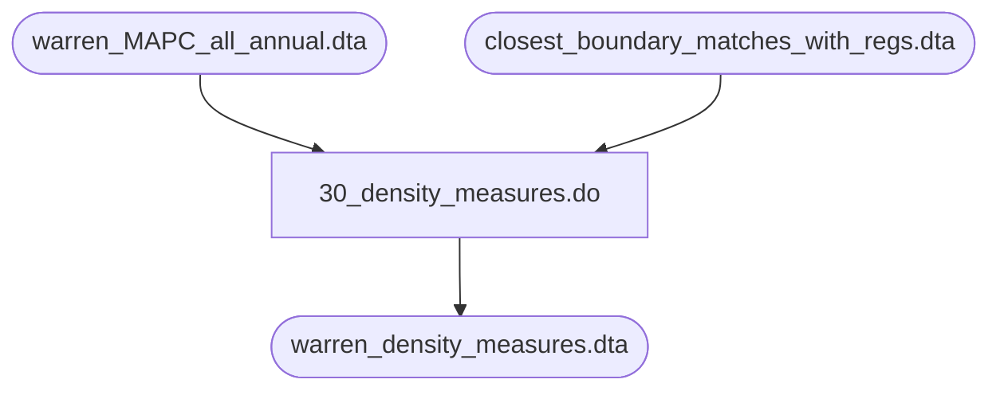
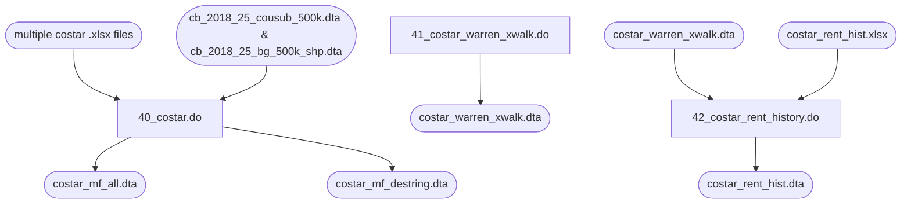
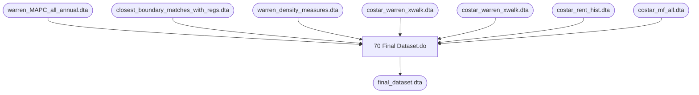

# Data Setup Files Guide

- [Introduction](#introduction)
- [Order of Files](#order-of-files)
    - [A Note about NHPD and CH40B files](#a-note-about-nhpd-and-ch40b-files)
    - [File Order Chart](#file-order-chart)
- [File descriptions](#file-descriptions)
    - [00_data_setup_master_file.do](#00_data_setup_master_filedo)
    - [20_boundary_matches.do](#20_boundary_matchesdo)
    - [30_density_measures.do](#30_density_measuredo)
    - [40_costar.do](#40_costardo)
    - [50_nhpd.do](#50_nhpddo)
    - [60_ch40b.do](#60_ch40bdo)
    - [70_final_dataset.do](#70_final_datasetdo)
    - [80_amenity_datasets.do](#80_amenity_datasetsdo)

[the readme file](#https://github.com/nchiumenti/boston_zoning/blob/main/docs/boston%20zoning%20readme.docx)

## Introduction
The files under the ./data_setup should be able to fully replicate the main dataset
used in the working paper. 

As with the analysis files, the master file sets up the file paths and runs the files
in go. 

These files have not been run for somet time, but so long as the source files and 
file paths have not changed they should still work and yeild the same result

I highly recomment referred to [the readme file](/docs/boston zoning readme.docx) I made way back in 2022 with any 
questions. I did outline a bunch of things below but the readme.docx file has a 
lot more detail

## Order of Files
Unlike the analysis files these ***need to be run in a specifc order***.

The workload jumps between Stata and Python code files. I tried to outline the 
general order of operations below. 

### A Note about NHPD and CH40B files
These national housing preservation database (NHPD) and chapter 40b (CH40B) analysis
is no longer found in the workpaper that has been submitted to a journal. However it
is found in the Boston Fed report and ***must*** still be included because it 
updated important variables like num_units for properties that do not otherwise
have tax records (for example public housing properties which are not taxed).

### File Order Chart

## Files and Replication Status
### Stata .do files
| File Name| Checked/Cleaned | Run Successfully by Mike | Replicates Results|
|----------|:------------:|:----------------:|:----------------:|
| 00_data_setup_master_file.do |  |  |  | 
| 10_warren_data_compile.do | ✅ | ✅ | ✅ |
| 11_geocoding.do | ✅ | ✅ | ✅ | 
| 12_res_types.do | ✅ | ✅ | ✅ |
| 13_condo_collapse.do | ✅ | ✅ | ✅ |
| 20_boundary_matches.do | ✅ | ✅ | ✅ |
| 30_density_measures.do | ✅ | ✅ | ✅ |
| 40_costar.do | ✅ | ✅ | ✅ | 
| 41_costar_warren_xwalk.do | ✅ | ✅ | ✅ |
| 42_costar_rent_history.do | ✅ | ✅ | ✅ |
| 50_nhpd.do | ✅ | ✅ | ✅ |
| 51_nhpd_boundary_matches.do | ✅ | ✅ | ✅ |
| 52_nhpd_warren_xwalk.do | ✅ | ✅ | ✅ |
| 60_ch40b.do | ✅ | ✅ | ⚠️ |
| 61_ch40b_boundary_matches.do | ✅ | ✅ | ⚠️ |
| 62_ch40b_warren_xwalk.do | ✅ | ✅ | ✅ |
| 70_final_dataset.do | ✅ | ✅ | ✅ |
| 80_amenity_datasets.do | ✅ | ✅ | ✅ | 
| town_lists_export.do | ❌ | ❌ |  | 
| warren_geocode_fixes.do | ❌ | ❌ |  | 

### Python .ipynb/./py files
| File Name| Checked/Cleaned | Run Successfully by Mike | Replicates Results|
|----------|:------------:|:----------------:|:----------------:|
| ***./census_geocoder_api/*** |-|-|-|
| BatchAddressMatch_final.ipynb | - | - | - |
| ***./closest_boundary_matches/*** |-|-|-|
| closest_boundary_matches_ch40b.ipynb | ❌ | ❌ | ❌ |
| closest_boundary_matches_mtlines.ipynb | ✅ | ✅ | ✅ |
| closest_boundary_matches_nhpd.ipynb | ✅ | ✅ | ✅ |
| closest_boundary_matches_noroads.ipynb | ✅ | ✅ | ✅ |
| closest_boundary_matches.ipynb | ✅ | ✅ | ✅ |
| ***./soil_quality_data/*** | - | - | - |
| soil_quality_matching.ipynb | ❌ | ❌ | ❌ |
| ***./transit_distances/*** | - | - | - |
| all_stations.ipynb | ✅ | ✅ | ✅ | 
| dist_prop_to_station.ipynb | ✅ | ✅ | ✅ | 
| dist_south_station.ipynb | ✅ | ✅ | ✅ | 
| station_boundary_dist.ipynb | ✅ | ✅ | ✅ |
| ***./walking_distances/*** |-|-|-|
| walking_distances_osrm.ipynb | ✅ | ✅ | ✅ |
| ***./zone_assignments/*** |-|-|-|
| zone_assigments_ch40b.ipynb | ❌ | ❌ | ❌ |
| zone_assigments_nhpd.ipynb | ✅ | ✅ | ✅ |
| zone_assigments.ipynb | ✅ | ✅ | ✅ |

## File descriptions

### 00_data_setup_master_file.do
This file sets all of the global paths used throughout the setup. Right now it is specific to file paths found on
the Boston Fed servers.

### 10_warren_data_compile_.do
Takes the raw downloaded warren data calls a number of sub-scripts to clean the data:
- calls 11_geocoding.do to fix lat/lon geocoding issues
- calls 12_res_types.do to condense property type classification variables and trim dataset
- called 13_condo_collapse.do to collapse condo buildiings so the number of units is summed to the address (note in the end condos were excluded because they are not captured uniformally across municipalities.

After cleaning several distinct .dta datasets are saved:
- warren_MA_all_unique.dta --> a unique list of all properties in MA, by prop_id
- warren_MA_all_annual.dta --> all residential properties in MA, unique by year and prop_id
- warren_MAPC_all_annual.dta --> all residential properties in the MAPC region (used as Greater Boston definition), unique by year and prop_id
- warren_MAPC_all_unique.dta --> unique list of properties in the MAPC region

### 20_boundary_matches.do
The file takes the output of closest_boundary_matches.ipynb and finds the best closest 
boundary match between warren group property and mapc zoning boundary.

### 30_density_measures.do
Calculates the share of properties that are single-family and 2-3 units around 
.1 miles of every property record that is 1 mile or less from the zone boundary.

### 40_costar.do
Imports all data from excel file downloads and stores in
one stata .dta file. Uses the first row as variable headers.
Data was downloaded from CoStar.com in batches for all
city and towns in the MAPC service region. Contains data 
only on multi-family properties in CoStar which usually 
excludes 1-4 unit properties.

This main file also calls 2 sub-files that can be run
independently to export a warren->costar crosswalk and
a costar rent history dataset

### 50_nhpd.do
Cleans the original 'All Properties.xlsx' download. 
Returns 2 datasets of (1) all properties in MA and all
properties in MAPC region. The MAPC region file also has
boundary IDs assigned to properties (for use in the 
warren/nhpd crosswalk).

### 60_ch40b.do
Cleans the original ch40b file. 
Returns 2 datasets of (1) all ch40b properties in raw but
usable format and (2) a clean version with boundary IDs
attached (for use in the warren/ch40b crosswalk).

Two python programs are run on JupyterHub. (1) a geocoding
programs that assigns lat/lon coordinates using the 
Census API geocoder. (2) the boundary match program similar
to the one that is used for the Warren records.
 				
Note 08/06/2021: An initial partial list of CH40B properties
was received back in December 2020. We received an updated 
full list of properties in May of 2021. Because of time 
constraints the hand matching with Warren datathat was done 
to the initial list could not be expanded upon. The hand-matches
from this initial list are used plus geocoding of the new
list when applicable to find all best matches between CH40B
and Warren properties.

Note 10/15/2021: Additional hand geocoding was done on 
properties by research assistants from U. Toronto 
working with Aradhya Sood. These additional coded 
properties are appended after the initial geocoding and 
before the boundary matching takes place.

### 70_final_dataset.do
Creates the final dataset before analysis stage. This 
files combines the warren property data, and boundary
matches, the costar, nhpd, and ch40b data, and the 
density measures into one final dataset that is used
as the basis for almost all analysis files.

Note 12/22/2022: the ch40b and nhpd data are not used
in the final working paper that was submitted but are
used in the fed research reports. Even though they are not used they still
need to be kept in the file because they update the number of units etc.

