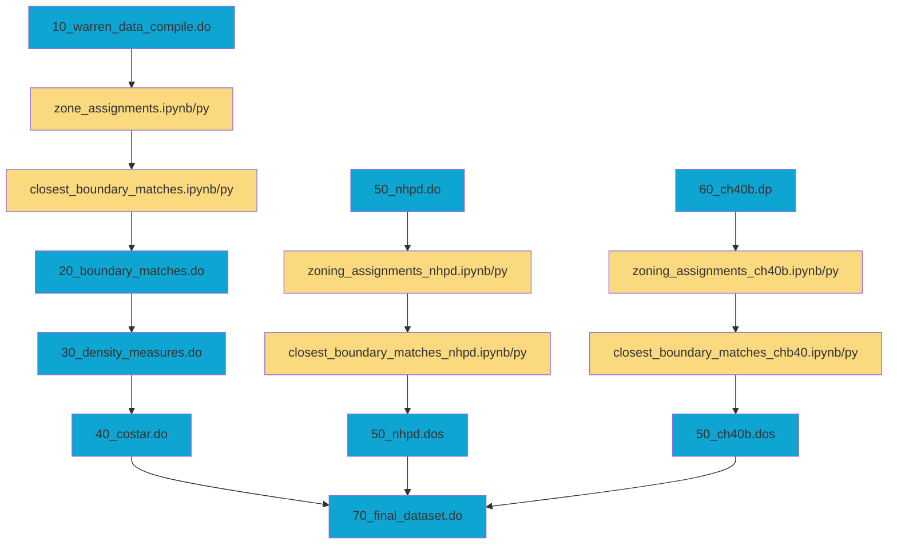
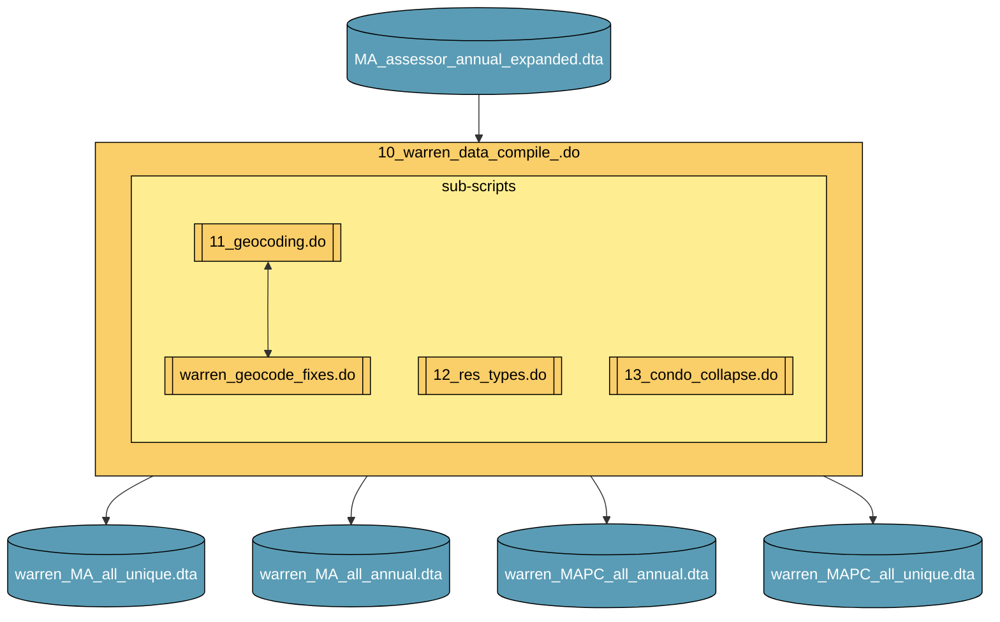
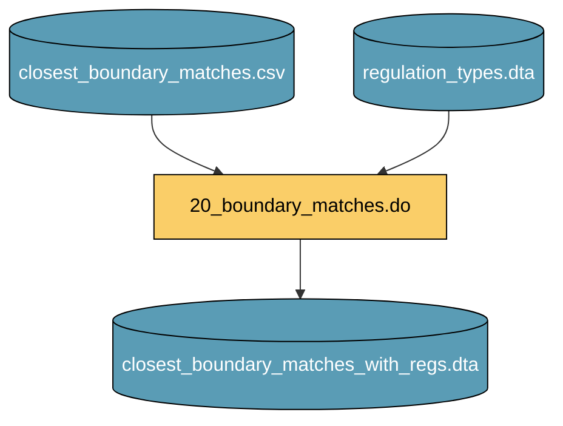
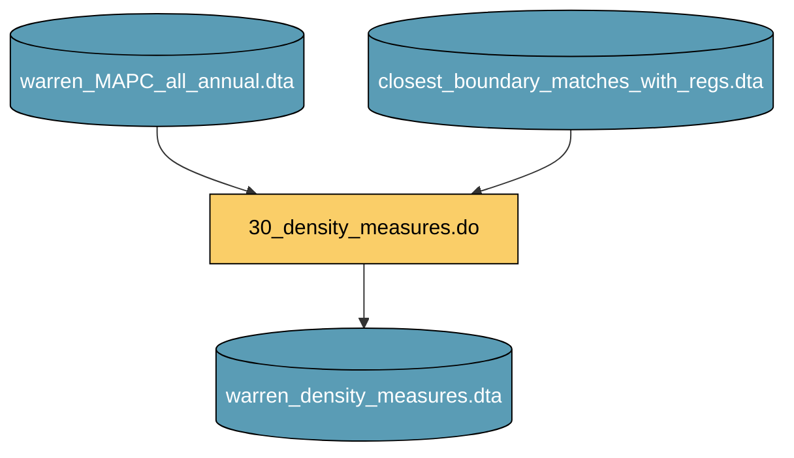
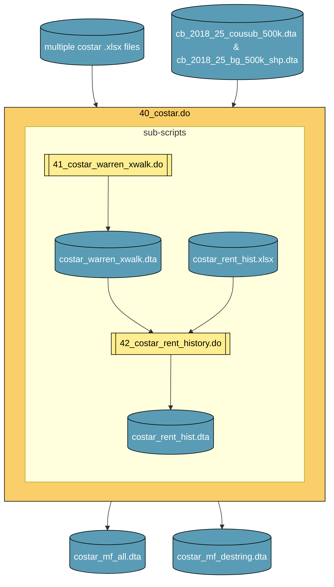
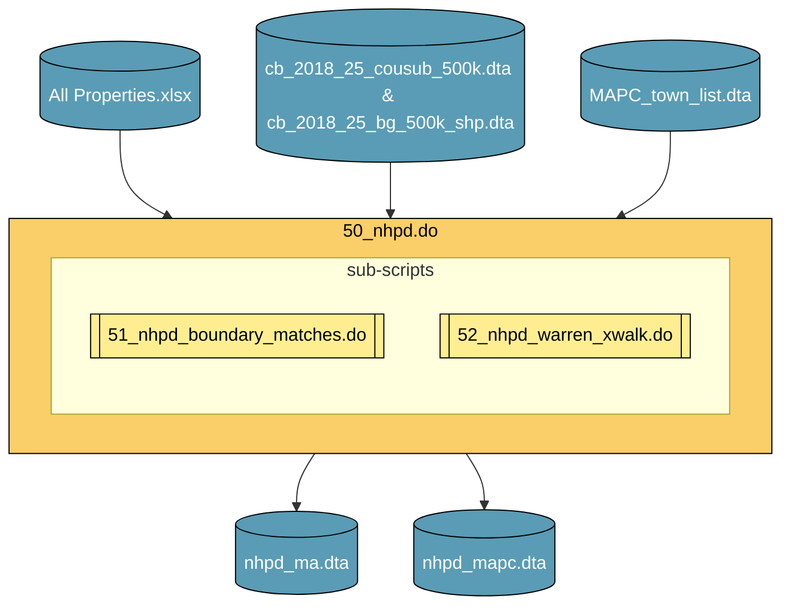
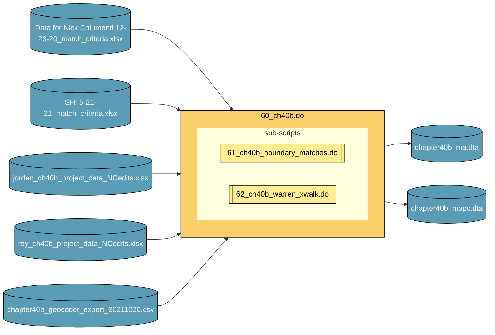
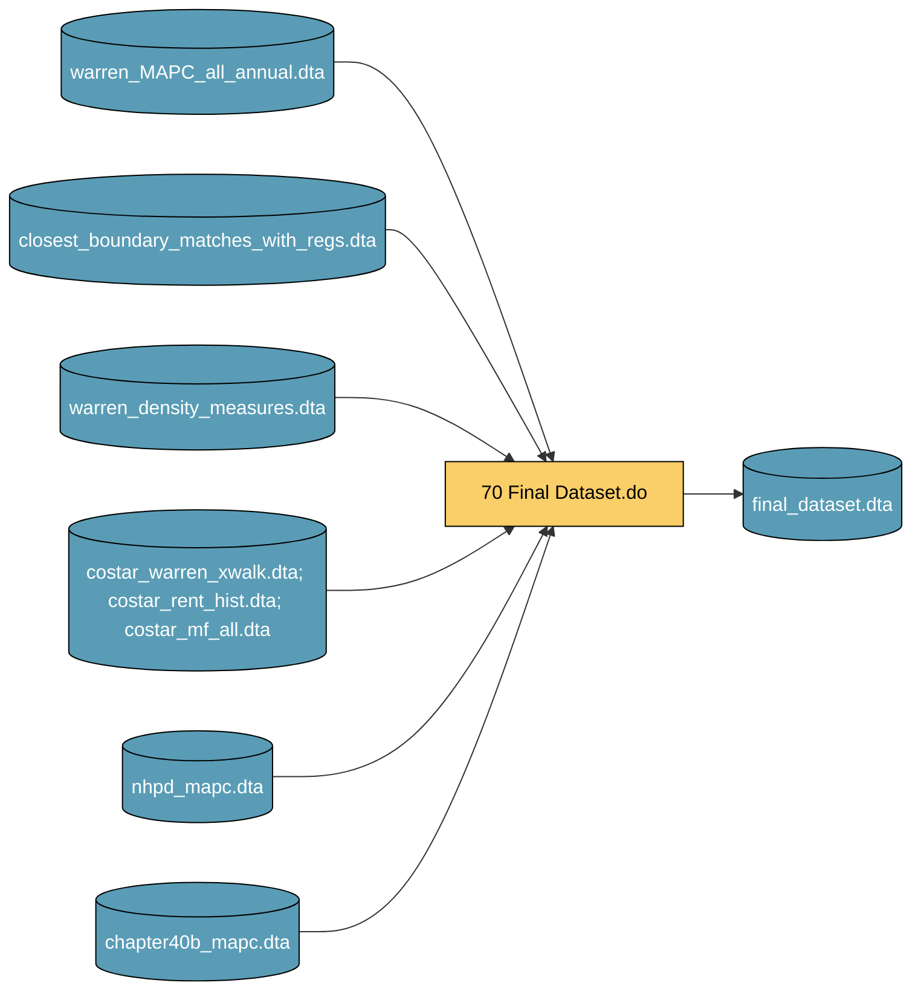
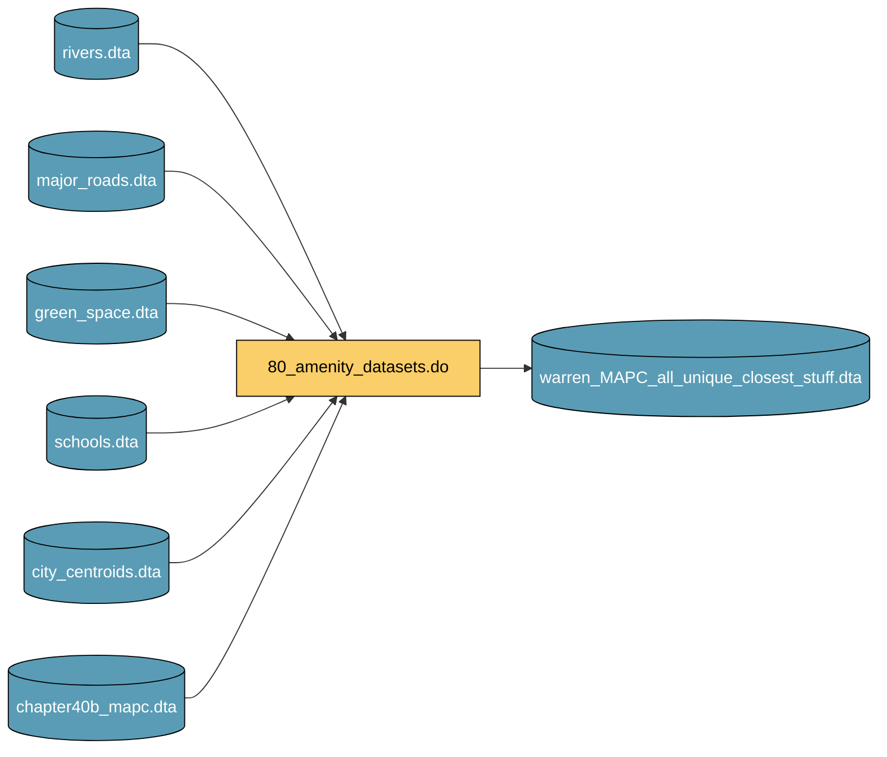

# Data Setup Files Guide

[🔙 Return to Start Here](/docs/README.md) | [🏠 Go to main page](/)

**Table of Contents**

- [Overview](#overview)
- [Order of files](#order-of-files)
- [Main Setup Files](#main-setup-files)
    - [00_data_setup_master_file.do](#00_data_setup_master_filedo)
    - [10_warren_data_compile.do](#10_warren_data_compiledo)
    - [20_boundary_matches.do](#20_boundary_matchesdo)
    - [30_density_measures.do](#30_density_measuresdo)
    - [40_costar.do](#40_costardo)
    - [50_nhpd.do](#50_nhpddo)
    - [60_ch40b.do](#60_ch40bdo)
    - [70_final_dataset.do](#70_final_datasetdo)
    - [80_amenity_datasets.do](#80_amenity_datasetsdo)
- [Python Setup Files](#python-setup-files)
    - [zone_assignments.ipynb](#zone_assignmentsipynb)
    - [closest_boundary_matches.ipynb](#closest_boundary_matchesipynb)
    - [soil_quality_matching.ipynb](#soil_quality_matchingipynb)
    - [all_stations.ipynb](#all_stationsipynb)
    - [dist_prop_to_station.ipynb](#dist_prop_to_stationipynb)
    - [dist_to_south_station.ipynb](#dist_to_south_stationipynb)
    - [station_boundary_dist.ipynb](#station_boundary_distipynb)
    - [walking_distances_orsm.ipynb](#walking_distances_orsmipynb)
    - [BatchAddressMatch_final.ipynb](#batchaddressmatch_finalipynb)
- [Miscellaneous Setup Files](#miscellaneous-setup-files)
    - [bg_amenities.do](#bg_amenitiesdo)
    - [effective_dist_export.do](#effective_dist_exportdo)
    - [boundary_interior_parcels.do](#boundary_interior_parcelsdo)
    - [shp2dta.do](#shp2dtado)
    - [town_list_export.do](#town_list_exportdo)
    - [train_stations.do](#train_stationsdo)
    - [train_stations_mtlines.do](#train_stations_mtlinesdo)
    - [warren_geocode_fixes.do](#warren_geocode_fixesdo)

---

## Overview

The files under the [/code/data_setup](/code/data_setup/) create the main 
datasets used in the working paper. 
The files under [/code/data_setup/python_programs](/code/data_setup/python_programs/)
handle core setup functions that were done using Python and Jupyter Notebooks.
The files under [/code/data_setup/miscellaneous_setup_files](/code/data_setup/miscellaneous_setup_files/])
handle smaller setup or one-off data processing jobs.

## Order of files

Setup files should be run in a specific order. This will include python programs 
detailed elsewhere. The workload jumps between Stata and Python code files. 
Below is an outline the general order of file: 

> [!IMPORTANT]
> Directory structure is important in order to limit errors that come with 
> running the code files. To the best of our ability we have tried to generalize
> the paths defined in code so that *in theory* a user can simple download this
> repository and change a few key components. Despite our best efforts, there 
> are bound to be areas we missed, and some of the directory structure has likely
> changed over time. We have provided [`_tree_data_dir.txt`](/data/_tree_data_dir.txt) 
> In an effort to illustrate where some files should be located that were not
> able to be shared in this repository. 

---

## Main Setup Files

### `00_data_setup_master_file.do`

**Description**

This .do file is a master .do file for the data setup files that calls all 
relevant sub files in the order they should be run. It is also sets global file
paths used throughout the setup process.

**Inputs**

n/a

**Outputs**

n/a

**Sub-scripts**

n/a

----

### `10_warren_data_compile.do` 

**Description**

Uses the Warren Group MA time series property file to construct 4 data sets. 
These datasets contain total properties for each year between 2007-2019 and a
unique set of every unique property record during those years.

`MA_assessor_annual_expanded.dta` is the source warren data held by the Federal
Reserve Bank of Boston (see [data sources](/docs/data_sources.md) for details).

show flow
 

**Inputs**

- `MA_assessor_annual_expanded.dta` - all residential properties in MA, unique by year and prop_id
- `cb_2018_25_cousub_500k_shp.dta` - coordinates file of converted county subdivision shapefile
- `cb_2018_25_cousub_500k.dta` - data file of converted county subdivision shapefile
- `MAPC_town_list.dta` - hand-coded list of cities and town in MAPC region

**Outputs**

- `warren_MA_all_annual.dta` - all residential properties in MA, unique by year and prop_id
- `warren_MA_all_unique.dta` - a unique list of all properties in MA, by prop_id
- `warren_MAPC_all_annual.dta` - all residential properties in the MAPC region, unique by year and prop_id
- `warren_MAPC_all_unique.dta` - unique list of all residential properties in the MAPC region,

**Sub-scripts**

- `11_geocoding.do` fixes some lat/lon geocoding issues present in initial raw 
data via  to fix lat/lon geocoding issues
- `12_res_types.do` condenses property type classification variables and trims 
the dataset of non-residential properties.
- `13_condo_collapse.do` collapses condo buildings so the number of units is 
summed to the address (note in the end condos were excluded because they are 
not captured uniformly across municipalities.)

---

### `20_boundary_matches.do`

**Description**

Requires running a series of python scripts beforehand to have the necessary
input files (see [Python Setup Files](#python-setup-files)).

The file takes the output of closest_boundary_matches.ipynb and finds the best 
closest boundary match between warren group property and MAPC zoning boundary. 
Assigns home zoning regulations and regulations to the comparison zoning area 
on the other side of the boundary.

`regulation_types.dta` is a file constructed using ArcGIS directly from the
MAPC zoning atlas, and contains the paired (home and neighbor) boundary-level 
zoning regulations data that is matched onto each boundary-property match. 
`warren_town_boundary_matches.do` is a miscellaneous setup file version of this 
program that handles the town boundary matching.

show flow
 

**Inputs**

- `closest_boundary_matches.csv` - output from `closest_boundary_matches.ipynb` 
that matches a warren group property to the five closest zoning boundaries.
- `regulation_types.dta` - zoning area level regulations data.

**Outputs**

- `closest_boundary_matches_with_regs.dta` - property level dataset with matched 
zoning boundary regulations.

**Sub-scripts**

n/a

--- 

### `30_density_measures.do`

**Description**
Note that this files handles setup for analysis that is no longer relevant to the 
paper. However, future files reference output from these steps and so may throw 
runtime errors if not present.

Calculates the share of properties that are single-family and 2-3 units around 
.1 miles of every property record that is 1 mile or less from the zone boundary.

show flow
 

**Inputs**

- `warren_MAPC_all_annual.dta` - all residential properties in the MAPC region, 
unique by year and prop_id.
- `closest_boundary_matches_with_regs.dta` - property level dataset with matched 
zoning boundary regulations.

**Outputs**

- `warren_density_measures.dta` - property level dataset that has data on local 
density measures, within one mile of property.

**Sub-scripts**

n/a

---

### `40_costar.do`

**Description**

Imports all data from excel file downloads and stores in one Stata .dta file. 
Uses the first row as variable headers. Data was downloaded from CoStar\.com in  
batches for all city and towns in the MAPC service region. Contains data only on 
multi-family properties in CoStar which usually excludes 1-4 unit properties.

This main file also calls 2 sub-files that can be run independently to export a 
warren &rarr; costar crosswalk and a costar rent history dataset.

CoStar data had to be hand scraped from their website due to limitations with
the platform. Refer to the `_tree.txt` file under `/data/costar/` for the 
structure.

For the property rent history data there is a missing python file 
`costar_props.ipynb` that iterated through the property rent history directory
to combine these all into one excel file.

show flow
 

**Inputs**

Multiple costar input .xlsx files from hand-scraping the CoStar data.

- `cb_2018_25_cousub_500k.dta/cb_2018_25_bg_500k_shp.dta` and related shapefile for geocoding.

**Outputs**

- `costar_mf_all.dta` - all costar property data within the MAPC region, result of 
hand-scraping.
- `costar_mf_destring.dta` - a de-stringed version of the above for easier use later on.

**Sub-scripts**

- `41_costar_warren_xwalk.do` - matches warren group properties to the 
corresponding costar data.
- `42_costar_rent_history.do` - compiles the rent history data for costar 
properties and matches to the warren group data.

---

### `50_nhpd.do`

**Description**

Cleans the original 'All Properties.xlsx' download. 
Returns 2 datasets of (1) all properties in MA and all
properties in MAPC region. The MAPC region file also has
boundary IDs assigned to properties (for use in the 
Warren/NHPD crosswalk).

NHPD properties are matched independently to MAPC zoning boundaries via their
own python file.

show flow
 

**Inputs**

- `All Properties.xlsx` - the raw data downloaded from www.preservationdatabase.org
- `cb_2018_25_cousub_500k.dta/cb_2018_25_bg_500k_shp.dta` and related shapefile for geocoding.

**Outputs**

- `nhpd_ma.dta` - subsidized property data for all of massachusetts
- `nhpd_ma.dta` - subsidized property data for MAPC region

**Sub-scripts**

- `51_nhpd_boundary_matches.do` - matches NHPD properties to their corresponding
zoning boundary.
- `52_nhpd_warren_xwalk.do` - matches warren group properties to the 
corresponding costar data.

----

### `60_ch40b.do`

**Description**

Cleans the original ch40b file. Returns two datasets of (1) all ch40b properties in raw but
usable format and (2) a clean version with boundary IDs attached 
(for use in the warren/ch40b crosswalk).

show flow
 

**Inputs**

- `Data for Nick Chiumenti 12-23-20_match_criteria.xlsx` - is the original data
with corresponding cleaned addresses. SHI refers to the subsidized housing
inventory reference list. The `jordan_` and `roy_` files are additional small project mappings done for 
properties not identified previously.

- `chapter40b_geocoder_export_20211020.csv` is the lat/lon coordinates geocoded
using the census geocoder batch api.

**Outputs**

- `ch40b_ma.dta` - ch40b data for all of massachusetts
- `ch40b_ma.dta` - ch40b property data for MAPC region

**Sub-scripts**

- `61_ch40b_boundary_matches.do` - matches ch40b properties to their corresponding
zoning boundary.
- `62_ch40b_warren_xwalk.do` - matches warren group properties to the 
corresponding costar data.

----

### `70_final_dataset.do`

**Description**

Creates the final dataset before analysis stage. This 
files combines the warren property data, and boundary
matches, CoStar, NHPD, and ch40b data, and the 
density measures into one final dataset that is used
as the basis for almost all analysis files. `final_dataset_town_boundary_comparisons.do`
is a version of this file that creates the town boundary matches final dataset.

>[!NOTE]
> The Chapter 40B and NHPD data are not used in the final submitted manuscript. Even 
> though they are not used they still included here because they retain the 
> ability to run these files without interruption as editing them to omit their 
> inclusion would likely result in files that error-out.

show flow
 

**Inputs**

- `warren_MAPC_all_annual.dta` - all residential properties in the MAPC region, 
unique by year and prop_id.
- `closest_boundary_matches_with_regs.dta` - warren group properties with their
assigned closest boundary segment and associated zoning regulations.
- `warren_density_measures.dta` - warren group properties with the local area 
density measures (gentle and high density).
- `costar_` files contain the costar to warren crosswalks, the rent history, and 
the property information.
- `nhpd_mapc.dta` - is the match nhpd property information for subsidized housing
- `chapter40b_mapc.dta` - is the matched chapter 40b property information.

**Outputs**

- `final_dataset.dta` - represents the final working version of the analysis data,
used as the basis for all subsequeny files. In practice, this file was created
multiple times. 

> [!NOTE]
The version **`final_dataset_10-28-2021.dta`** represents the 
final version which is used and is referenced in essentially all analysis files.
In practice, this final working file is altered susequently to respond to 
various comments, changes, and referee requests.

**Sub-scripts**

n/a

----

### `80_amenity_datasets.do`

**Description**

This file combines a number of 'amenities' into one .dta file to merge on for
analaysis later one.

Essentially, this file compiles the distance between warren group properties and
the closest amenity type (schools, green space, roads, rivers, etc.)

This file is not part of the creation of the main working data but is integral 
to susequent analysis. 

show flow
 

**Inputs**

All input datasets are conversions of shape files, with the distance to the 
closest feature measured using *geonear*.

**Outputs**

`warren_MAPC_all_unique_closest_stuff.dta` - contains warren group property ids
and distances to the closest amentiy feature.

**Sub-scripts**

n/a

 

## Python Setup Files

### `zone_assignments.ipynb`

**Description**

This program takes the unique set of all warren group property tax records in 
the MAPC region and assigns them to (1) a schools attendance area `ncessch`, (2) 
a zone use type area `zo_usety`, and (3) a left/right boundary id and regulation 
type area `l_r_fid` and `reg_type`. The exported .csv file is used in the 
`closest_boundary_matches.ipynb` program.

> [!NOTE]
> There are multiple iterations of this program, denoted by their suffix, each 
> handling a different input data source. The base `zone_assignments.ipynb` 
> handles the Warren Group properties.
>   -  zone_assignments.ipynb
>   -  zone_assignments_ch40b.ipynb
>   -  zone_assignments_nhpd.ipynb

**Inputs**

- `warren_MAPC_all_unique.dta`
- `./sabs_unique_latlong.shp`
- `./roads_mapc_union_sd_dissolved.shp`
- `./zoning_atlas_latlong.shp`

**Outputs**

- `./zone_assignments_export.csv`

**Sub-scripts**

n/a 

---
### `closest_boundary_matches.ipynb`

**Description**

This is a version of the original boundary matching file used to match address 
points to zoning boundaries. The output of this program is used as input 
for ./20_boundary_matches.do

> [!NOTE]
> There are multiple iterations of this program, denoted by their suffix, each 
> handling a different cut of data.
>   -  closest_boundary_matches.ipynb
>   -  closest_boundary_matches_ch40b.ipynb
>   -  closest_boundary_matches_nhpd.ipynb
>   -  closest_boundary_matches_mtlines.ipynb
>   -  closest_boundary_matches_noroads.ipynb
>   -  closest_town_boundary_matches.ipynb
>
> `closest_boundary_matches_mtlines.ipynb` is used in the final analysis but only identifies straight
> line boundaries. `closest_boundary_matches.ipynb` is what matches the actual 
> boundaries to warren properties.

**Inputs**

- `zone_assignments_export.csv`
- `adm3_latlong.shp`
- `regulation_types.dta`

**Outputs**

- `closest_boundary_matches.csv`

**Sub-scripts**

n/a

---

### `soil_quality_matching.ipynb`

**Description**

This file takes the soil quality data .shp file created by an RA and matches 
onto it our dataset of mapc warren group properties.

**Inputs**

- `Soil_Parcel_Data_shape.shp`
- `warren_MAPC_all_unique.dta`

**Outputs**

- `soil_quality_matches.dta`

**Sub-scripts**

n/a

---

### `all_stations.ipynb`

**Description**

This file compiles the commuter rail stations and the mbta rapid transit 
stations into one file to be used in calculating the distance to downtown 
measure in `amenities_mtines.do`.

**Inputs**

- `TRAINS_NODE.shp`
- `MBTA_NODE.shp`

**Outputs**

- `all_stations.csv`

**Sub-scripts**

n/a 

---

### `dist_prop_to_station.ipynb`

**Description**

This file calculates the distance from a property to its closest train stop in 
manhattan and euclidean distance. The output is used in the amenities file.

**Inputs**

- `all_stations.csv`
- `warren_MAPC_all_unqiue.dta`

**Outputs**

- `transit_distance.csv`

**Sub-scripts**

n/a

---

### `dist_to_south_station.ipynb`

**Description**

This program takes a dateset of MBTA and commuter rail stations
and calculates the travel distance from that station to South
Station in downtown Boston, MA. The output of this program is
eventually combined with the manhattan and euclidean distance 
output and used in the amenities file. 

Uses the HERE transit routing api to calculate the travel 
distance (in meters)

Note: The transit routes are date/time dependent and so will
change depending on when the program is run.

**Inputs**

- `all_stations.csv`

**Outputs**

- `dist_to_south_station.csv`

**Sub-scripts**

n/a

---

### `station_boundary_dist.ipynb`
**Description**

Takes the train stations file `all_stations.csv` and calcualtes the distance
between that and the zoning boundaries in `adm3.shp`. Exports 
`station_boundary_dist.csv`.

**Inputs**

- `adm3_latlong.shp`
- `all_stations.csv`

**Outputs**

- `station_boundary_dist.csv`

**Sub-scripts**

n/a

---

### `walking_distances_orsm.ipynb`

**Description**

Calculates the walking distances (in meters) between closest
properties to a boundary on either side of a boundary. 
Requires running effective_dist_export.do first

**Inputs**

- `effective_distance_inputs.csv`

**Outputs**

- `effective_distance_outputs.csv`

**Sub-scripts**

n/a

---

### `BatchAddressMatch_final.ipynb`

**Description**

Takes an exported set of warren group properties from 
geocode_fixes.do that have incorrect lat/lon geocoding and 
uploads them to the census's geocoder api website, downloads 
the correct lat/lon coordinates and saves it to a new file.
Note, that this file also handles some random geocoding tasks throughout the
setup process for data no longer used in the analysis (chap 40b and nhpd data).

**Inputs**

- `warren\geocode_fixes\<various>.txt`

**Outputs**

- `warren\geocode_fixes_<date>.csv`

**Sub-scripts**

n/a

---

## Miscellaneous Setup Files

### `effective_dist_export.do`

**Description**

Creates the effective distances input `.csv` file used in 
`walking_distances_orsm.ipynb`.

**Inputs**

- `final_dataset_10-28-2021.dta`

**Outputs**

- `effective_distance_inputs.csv`

**Sub-scripts**

- n/a

---

### `shp2dta.do`
**Description**

Extracts '.shp' and saves them as '.dta' files for use in mapping.

**Inputs**

various .shp files

**Outputs**

various .dta files

**Sub-scripts**

n/a

---

### `town_list_export.do`

**Description**

Creates two .dta files with a list of admissable cities and towns in 
Massachusetts and in the MAPC region.

**Inputs**

- `2019_gaz_cousubs_25.txt`
- `MAPC_town_list.txt`

**Outputs**

- `MA_cousub_list.dta`
- `MAPC_town_list.dta`

**Sub-scripts**

n/a

---

### `warren_geocode_fixes.do`
**Description**

Identifies those properties in the Warren data that have
miss-coded geo-ids, identified by those where the lat/long
do not match the city/town they are in. It is assumed that
the city/towns are correct because those come from the town
tax assessors and have the least likelihood of being wrong.

**Inputs**

- `MA_assessor_annual.dta`
- `address_corrections_input.dta`

**Outputs**

- `geocoder_export_`DateStamp'.csv`
- `address_corrections_input.dta`
- `address_corrections_output.dta`

**Sub-scripts**

 
 

<a href="#top">Back to Top</a>

